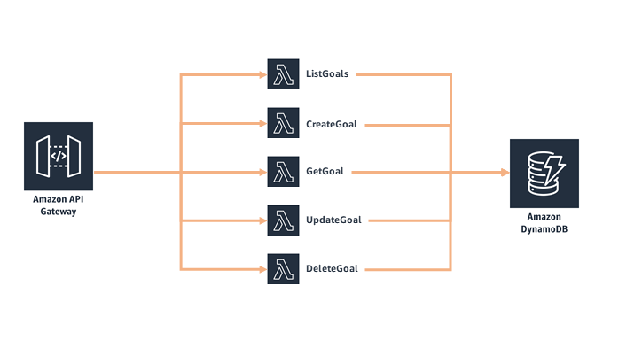

## AWS Full-Stack Template

AWS Full-Stack Template is a full-stack sample web application that creates a simple CRUD (create, read, update, delete) app, and provides the foundational services, components, and plumbing needed to get a basic web application up and running. [Try out the deployed application here](https://d2k5b8bzo1vefz.cloudfront.net/)!

The entire application - frontend, backend, and all configuration - can deployed in your AWS account with a single CloudFormation template.  Get started with building your own below!
&nbsp;

## License Summary

This sample code is made available under a modified MIT license. See the LICENSE file.

&nbsp;

## Outline

- [Overview](#overview)
- [Instructions](#instructions)
  - [Getting started](#getting-started)
  - [Cleaning up](#cleaning-up)
- [Architecture](#architecture)
- [Implementation details](#implementation-details)
  - [Amazon DynamoDB](#amazon-dynamodb)
  - [Amazon API Gateway](#amazon-api-gateway)
  - [AWS Lambda](#aws-lambda)
  - [AWS IAM](#aws-iam)
  - [Amazon Cognito](#amazon-cognito)
  - [Amazon Cloudfront and Amazon S3](#amazon-cloudfront-and-amazon-s3)
  - [Amazon Cloudwatch](#amazon-cloudwatch)
  - [AWS CodeCommit, AWS CodePipeline, AWS CodeBuild](#aws-codecommit-aws-codepipeline-aws-codebuild)
- [Considerations for demo purposes](#considerations-for-demo-purposes)
- [Known limitations](#known-limitations)
- [Additions, forks, and contributions](#additions-forks-and-contributions)
- [Questions and contact](#questions-and-contact)

&nbsp;

## Overview

The goal of the AWS Full-Stack Template is to provide a fully-functional web application that helps users accelerate building apps on AWS by providing an out-of-the-box template.  This template is production-ready and pre-loaded with best practices. Applications today have an increasing number of building blocks and infrastructure components, and AWS Full-Stack Template will help educate professionals and students alike to design software in a modern cloud computing world. With AWS Full-Stack Template, developers can create a cohesive, production-ready application on the cloud in minutes, allowing them to focus on building the pieces that matter and add value.

The provided CloudFormation template automates the entire creation and deployment of the AWS Full-Stack Template.  The template includes the following components:

**Database components**

* Goals list – Amazon DynamoDB offers fast, predictable performance for the key-value lookups needed in the goals app, and enormous scale so you can build on top of it..  In this implementation, we have unique identifiers for each goal, the goal name, and description.

**Application components**

* Serverless service backend – Amazon API Gateway powers the interface layer between the frontend and backend, and invokes serverless compute with AWS Lambda.  
* Web application blueprint – We include a React web application pre-integrated out-of-the-box with best practices and tools such as React Bootstrap, React Router, Typescript, and more.

**Infrastructure components**

* Continuous deployment code pipeline – AWS CodePipeline and AWS CodeBuild help you build, test, and release your application code.
* Serverless web application – Amazon CloudFront and Amazon S3 provide a globally-distributed application.

You can choose to customize the template to create your own goals app, modify it to make a different type of simple notes or to-do application, or add onto it to make a completely different type of web application.  

Users can build on top of AWS Full-Stack Template to create any application they envision, whether a travel booking tool, a blog, or another web app. The **AWS Bookstore Demo App** (available at [https://github.com/aws-samples/aws-bookstore-demo-app](https://github.com/aws-samples/aws-bookstore-demo-app)) is just one full-fledged example of what you might create using AWS Full-Stack Template. 

&nbsp;

---

&nbsp;

## Instructions

***IMPORTANT NOTE:** Creating this application in your AWS account will create and consume AWS resources, which **will cost money**.  We estimate that running this demo application will cost **<$0.10/hour** with light usage.  Be sure to shut down/remove all resources once you are finished to avoid ongoing charges to your AWS account (see instructions on cleaning up/tear down below).*

&nbsp;

### Getting started

To get the AWS Full-Stack Template up and running in your own AWS account, follow these steps (if you do not have an AWS account, please see [How do I create and activate a new Amazon Web Services account?](https://aws.amazon.com/premiumsupport/knowledge-center/create-and-activate-aws-account/)):

1. Log into the [AWS console](https://console.aws.amazon.com/) if you are not already
2. Choose **Launch Stack**  to open the AWS CloudFormation console and create a new stack.  
[](https://console.aws.amazon.com/cloudformation/home#/stacks/new?stackName=MyGoalsApp&templateURL=https://s3.amazonaws.com/aws-fullstack-template/master-fullstack.yaml)
3. Continue through the CloudFormation wizard steps
    1. Name your stack, i.e. MyGoalsApp
    2. Name your S3 bucket (must be lowercase and has to unique across all existing bucket names in Amazon S3).  See [bucket naming rules](https://docs.aws.amazon.com/AmazonS3/latest/dev//BucketRestrictions.html#bucketnamingrules).
    3. Provide a project name (must be lowercase, letters only, and **under ten characters**).  This is used when naming your resources, e.g. tables, etc.).
    4. After reviewing, check the blue box for creating IAM resources.
4. Choose **Create stack**.  This will take ~15 minutes to complete.
5. Sign into your application 
    1. The output of the CloudFormation stack creation will provide a CloudFront URL (in the *Outputs* section of your stack details page).  Copy and paste the CloudFront URL into your browser.
    2. You can sign into your application by registering an email address and a password.  Choose **Sign up to explore the demo** to register.  The registration/login experience is run in your AWS account, and the supplied credentials are stored in Amazon Cognito.  
*Note: given that this is a demo application, we highly suggest that you do not use an email and password combination that you use for other purposes (such as an AWS account, email, or e-commerce site).*
    3. Once you provide your credentials, you will receive a verification code at the email address you provided. Upon entering this verification code, you will be signed into the application.

&nbsp;

### Cleaning up

To tear down your application and remove all resources associated with the AWS Full-Stack Template, follow these steps:

1. Log into the AWS CloudFormation Console and find the stack you created for the demo app
2. Delete the stack
    1. Double-check that the S3 buckets created for the stack were successfully removed.

*Remember to shut down/remove all related resources once you are finished to avoid ongoing charges to your AWS account.*

&nbsp;

---

&nbsp;

## Architecture

**Summary diagram**


&nbsp;

**High-level, end-to-end diagram**


&nbsp;

**Frontend**

Build artifacts are stored in a S3 bucket where web application assets are maintained (web graphics, etc.). Amazon CloudFront caches the frontend content from S3, presenting the application to the user via a CloudFront distribution.  The frontend interacts with Amazon Cognito and Amazon API Gateway only.  Amazon Cognito is used for all authentication requests, whereas API Gateway (and Lambda) is used for all API calls to DynamoDB.

**Backend**

The core of the backend infrastructure consists of Amazon Cognito, Amazon DynamoDB, AWS Lambda, and Amazon API Gateway. The application leverages Amazon Cognito for user authentication, and Amazon DynamoDB to store all of the data for the goals. 



&nbsp;

**Developer Tools**

The code is hosted in AWS CodeCommit. AWS CodePipeline builds the web application using AWS CodeBuild. After successfully building, CodeBuild copies the build artifacts into a S3 bucket where the web application assets are maintained (web graphics, etc.). Along with uploading to Amazon S3, CodeBuild invalidates the cache so users always see the latest experience when accessing the storefront through the Amazon CloudFront distribution.  AWS CodeCommit. AWS CodePipeline, and AWS CodeBuild are used in the deployment and update processes only, not while the application is in a steady-state of use.


&nbsp;

---

&nbsp;

## Implementation details

*Note: The provided CloudFormation template contains only a portion of the resources needed to create and run the application.  There are web assets (images, etc.), Lambda functions, and other resources called from the template to create the full experience.  These resources are stored in a public-facing S3 bucket and referenced in the template.*

&nbsp;

### Amazon DynamoDB

The backend of the AWS Full-Stack Template leverages Amazon DynamoDB to enable dynamic scaling and the ability to add features as we improve our goals application. The application creates one table in DynamoDB: *Goals.*  DynamoDB's primary key consists of a partition (hash) key and an optional sort (range) key. The primary key (partition and sort key together) must be unique.

**Goals Table**

```js
GoalsTable {
  userId: string (primary partition key)
  goalId: string (primary sort key)
  title: string
  content: string
  createdAt: number
}
```

The table's primary key is made up of the user ID (partition key) and the goal ID (sort key).  This composite primary key allows us to use DynamoDB's scan capability - with only the user ID set - and return only the goals that that are in the user's account.  It also allows us to query DynamoDB on a user ID and goal ID, returning goal details without additional data processing.

&nbsp;

### Amazon API Gateway

Amazon API Gateway acts as the interface layer between the frontend (Amazon CloudFront, Amazon S3) and AWS Lambda, which calls the backend (database). Below are the different APIs the application uses:

**Goals (DynamoDB)**

GET /goals (ListGoals)  
POST /goals (CreateGoal)  
GET /goals/{:id} (GetGoal)  
PUT /goals/{:id} (UpdateGoal)  
DELETE /goals/{:id} (DeleteGoal)  

&nbsp;

### AWS Lambda

AWS Lambda is used in a few different places to run the application, as shown in the architecture diagram.  The important Lambda functions that are deployed as part of the template are shown below, and available in the [functions](/functions) folder.  In the cases where the response fields are blank, the application will return a statusCode 200 or 500 for success or failure, respectively.

&nbsp;

**ListGoals**

Lambda function that lists the user's goals. The user's account ID is retrieved through the request context (does not need to be explicity provided in the request).

```js
ListGoalsRequest {

}
```

```js
ListGoalsResponse {
    goals: goal[]
}
```

```js
goal {
    goalId: string
    title: string
    content: string
    createdAt: number
}
```

&nbsp;

**GetGoal**

Lambda function that returns the properties of a goal.

```js
GetGoalRequest {
    goalId: string
}
```

```js
GetGoalResponse {
    goalId: string
    title: string
    content: string
    createdAt: number
}
```

&nbsp;

**CreateGoal**

Lambda function that creates a specified goal in the user's account.

```js
CreateGoalRequest {
    title: string
    content: string
}
```

```js
CreateGoalResponse {

}
```

&nbsp;

**DeleteGoal**

Lambda function that removes a given goal from the user's account.  

```js
DeleteGoalRequest {
    goalId: string
}
```

```js
DeleteGoalResponse {

}
```

&nbsp;

**UpdateGoal**

Lambda function that updates the user's goal with a new title and/or content.

```js
UpdateGoalRequest {
    title: string
    content: string
}
```

```js
UpdateGoalResponse {
    
}
```

&nbsp;


### AWS IAM

The following IAM role (and included policies) is needed to run the application:

**DynamoDbLambda**  
*AWS managed policy*  
AWSLambdaBasicExecutionRole  
*Inline policy*  
GoalsPolicy  
&nbsp;&nbsp;&nbsp;&nbsp;dynamodb:PutItem - table/Goals  
&nbsp;&nbsp;&nbsp;&nbsp;dynamodb:Query - table/Goals  
&nbsp;&nbsp;&nbsp;&nbsp;dynamodb:UpdateItem - table/Goals  
&nbsp;&nbsp;&nbsp;&nbsp;dynamodb:GetItem - table/Goals  
&nbsp;&nbsp;&nbsp;&nbsp;dynamodb:Scan - table/Goals  
&nbsp;&nbsp;&nbsp;&nbsp;dynamodb:DeleteItem - table/Goals

&nbsp;

### Amazon Cognito

Amazon Cognito handles user account creation and login for the goals application.  For the purposes of this template, you can only browse your goals after login, which could represent the architecture of different types of web apps.  Users can also choose to separate the architecture, where portions of the web app are publicly available and others are available upon login.

User Authentication
* Email address

Amazon Cognito passes the CognitoIdentityID (which AWS Full-Stack Template uses as the Customer ID) for every user along with every request from Amazon API Gateway to Lambda, which helps the services authenticate against which user is doing what.

&nbsp;

### Amazon CloudFront and Amazon S3

Amazon CloudFront hosts the web application frontend that users interface with.  This includes web assets like pages and images.  For demo purposes, CloudFormation pulls these resources from S3.

&nbsp;

### Amazon CloudWatch

The capabilities provided by CloudWatch are not exposed to the end users of the web app, rather the developer/administrator can use CloudWatch logs, alarms, and graphs to track the usage and performance of their web application.

&nbsp;

### AWS CodeCommit, AWS CodePipeline, AWS CodeBuild

Similar to CloudWatch, the capabilities provided by CodeCommit, CodePipeline, and CodeBuild are not exposed to the end users of the web app.  The developer/administrator can use these tools to help stage and deploy the application as it is updated and improved.

&nbsp;

---

&nbsp;

## Considerations for demo purposes

1. Web assets (pages, images, etc.) are pulled from a public S3 bucket via the CloudFormation template to create the frontend for the AWS Full-Stack Template.  When building your own web application (or customizing this one), you will likely pull from your own S3 buckets.  If you customize the lambda functions, you will want to store these separately, as well.

&nbsp;

---

&nbsp;

## Known limitations

* The application was written for demonstration purposes and not for production use.
* Validation is working properly from an end-user standpoint, but is not cleanly implemented. For instance, the submit buttons (to create a goal, update a goal, login, signup, and enter confirmation code) are disabled (as designed) when validation fails, but we added an extra helper function to support this.  This issue occured when the app was upgraded to Bootstrap 4.  We plan to fix this in a future revision.
* In today's implementation, we have all of the Lambda functions associated with one IAM role.  Ideally, each Lambda function would have its own scoped-down IAM role and policies.
* Upon the first use of a Lambda function, cold start times can be slow. Once the Lambda function has been warmed up, performance will improve.  

&nbsp;

---

&nbsp;

## Additions, forks, and contributions

We are excited that you are interested in using the AWS Full-Stack Template!  This is a great place to start if you are just beginning with AWS and want to get a functional application up and running.  It is equally useful if you are looking for a sample full-stack application to fork off of and build your own custom application.  We encourage developer participation via contributions and suggested additions.  Of course you are welcome to create your own version!

Please see the [contributing guidelines](CONTRIBUTING.md) for more information.

For just one example of how you can build on top of this, check out **AWS Bookstore Demo App** (available at [https://github.com/aws-samples/aws-bookstore-demo-app](https://github.com/aws-samples/aws-bookstore-demo-app)), which was built on top of AWS Full Stack Template.

&nbsp;

---

&nbsp;

## Questions and contact

For questions on the AWS Full-Stack Template, or to contact the team, please leave a comment on GitHub.
