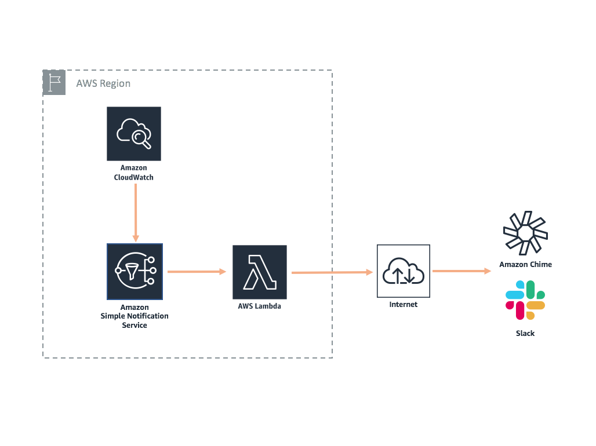

## CloudWatch to Slack/Chime notifications

This extension enables you to send alerts from CloudWatch alarms to Slack or Amazon Chime and creates everything necessary in a single CloudFormation template. All you need is to specify your CloudWatch alarm name and a Slack or Chime webhook URL.

As part of the CloudFormation template, this extension will setup an SNS Topic, attach it to your CloudWatch alarm, and create a Lambda function that will send alerts to your Slack or Amazon Chime channel.

## License Summary

This sample code is made available under a modified MIT license. See the LICENSE file.

## Outline

- [Overview](#overview)
- [Instructions](#instructions)
  - [Getting started](#getting-started)
  - [Cleaning up](#cleaning-up)
- [Architecture](#architecture)
- [Implementation details](#implementation-details)
  - [Amazon SNS](#amazon-sns)
  - [AWS Lambda](#aws-lambda)
- [Limitations](#limitations)
- [Suggestions](#suggestions)
- [Additions, forks, and contributions](#additions-forks-and-contributions)

## Overview

The goal of the CloudWatch alarms to Slack or Chime extension is to simplify and automate the process of getting your CloudWatch alarms to post in your messaging application. The provided CloudFormation template automates the entire creation and deployment of the extension.  The template will:

* Create a SNS topic
* Add the SNS topic as an action to your CloudWatch alarm
* Create a Lambda function to process the alarm and call your webhook url
* Subscribe the Lambda function to the SNS topic 

## Instructions

*IMPORTANT NOTE*: Creating this application in your AWS account will create and consume AWS resources, which will cost *money*. We estimate that running this extension will cost *<$0.05/year* with light usage. This will vary on the number of notifications from your CloudWatch alarm. AWS Lambda offers 1M free requests per month. Be sure to shut down/remove all resources once you are finished to avoid ongoing charges to your AWS account (see instructions on cleaning up/tear down below).

## Getting started

To get the CloudWatch alarm to Slack or Chime extension up and running in your AWS account, follow these steps (if you do not have an AWS account, please see [How do I create and activate a new Amazon Web Services account?](https://aws.amazon.com/premiumsupport/knowledge-center/create-and-activate-aws-account/)):

1. Log into the [AWS console](https://console.aws.amazon.com/) if you are not already
2. Choose one of the **Launch Stack** buttons below for your desired AWS region to open the AWS CloudFormation console and create a new stack. The CloudWatch alarm to Slack or Chime extension is supported in the following regions:

Region name | Region code | Launch
--- | --- | ---
US East (N. Virginia) | us-east-1 |  
US West (Oregon) |	us-west-2 |  
EU (Ireland) |	eu-west-1 |  
EU (Frankfurt) |	eu-central-1 | 

3. Continue through the CloudFormation wizard steps
    1. Name your stack, e.g. CWToSlack
    2. Enter the name of the CloudWatch alarm to integrate with
    3. Specify the Slack or Amazon Chime webhook you want to send alerts to
    4. After reviewing, check the blue box for creating IAM resources. 
4. Choose Create stack. This will take ~2 minutes to complete. 
5. You're done! 
    1. Want to recieve alerts for additional CloudWatch alarms, see  the section below. 

### Adding alerts for additional CloudWatch alarms

Once the stack has been created, you can add additional CloudWatch alarms that you want to receive alerts on. 
1. Go to the CloudWatch console and find the alarm you would like to subscribe to.
2. Add a Notification Action to your alarm and choose the SNS Topic that was created for you. The topic name will be [CloudwatchAlarm]-topic-[Slack/Chime]

### Cleaning up

To tear down your extension and remove all resources associated with the AWS CloudWatch to Slack/Chime extension, follow these steps:

1. Log into the AWS CloudFormation Console and find the stack you created for the demo app
2. Delete the stack

*Remember to shut down/remove all related resources once you are finished to avoid ongoing charges to your AWS account.*

## Architecture

## Implementation details

### Amazon SNS

Amazon Simple Notification Service is a managed pub/sub messaging service we use to receive alerts from CloudWatch and trigger the Lambda function that sends a message to the Slack/Chime channel.

### AWS Lambda

AWS Lambda is used in a few different places to run the application. The Lambda functions that are deployed as part of the template are shown below, and available in the [functions](https://github.com/awslabs/aws-full-stack-template/tree/master/extensions/cw-slack-chime/functions) folder.

*[CloudWatch Alarm Name]-SendAlert* - Lambda function processes the CloudWatch alarm message and calls the configured Slack/Chime webhook URL. 
*[CloudWatch Alarm Name]-FunctionSetupAlert* - Lambda function that intakes the newly created SNS topic and adds it as an action to your CloudWatch alarm. 

## Limitations 

- This extension only handles the SNS formatter for CloudWatch alerts. Want to contribute other formatters? Leave us a comment or a PR request!
- Currenly, this extension is limited to support one webhook URL. To send to multiple webhook URLs, you will need to deploy the template again and specify the additional webhook URL.

## Suggestions

Have other ideas for extensions we should build? Leave a comment on GitHub!

## Additions, forks, and contributions

We are excited that you are interested in using [AWS Full-Stack Template](https://github.com/awslabs/aws-full-stack-template) and some of these extensions! This is a great place to start if you are just beginning with AWS and want to get a functional application up and running. It is equally useful if you are looking for a sample full-stack application to fork off of and build your own custom application. We encourage developer participation via contributions and suggested additions. Of course you are welcome to create your own version!
Please see the [contributing guidelines](https://github.com/awslabs/aws-full-stack-template/blob/master/CONTRIBUTING.md) for more information.

For just one example of how you can build on top of this, check out [AWS Bookstore Demo App](https://github.com/aws-samples/aws-bookstore-demo-app), which was built on top of AWS Full-Stack Template and the [Search API extension](https://github.com/awslabs/aws-full-stack-template/tree/master/extensions/search-api).
